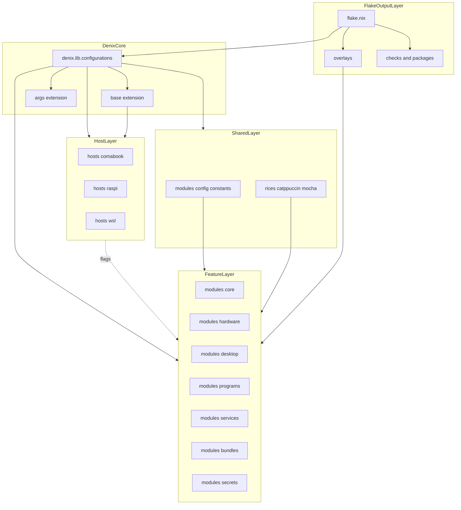
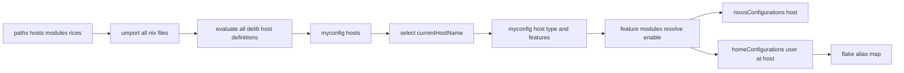
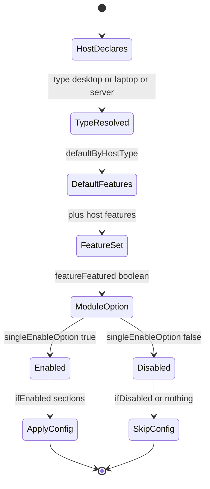
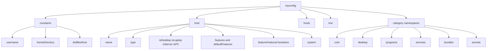
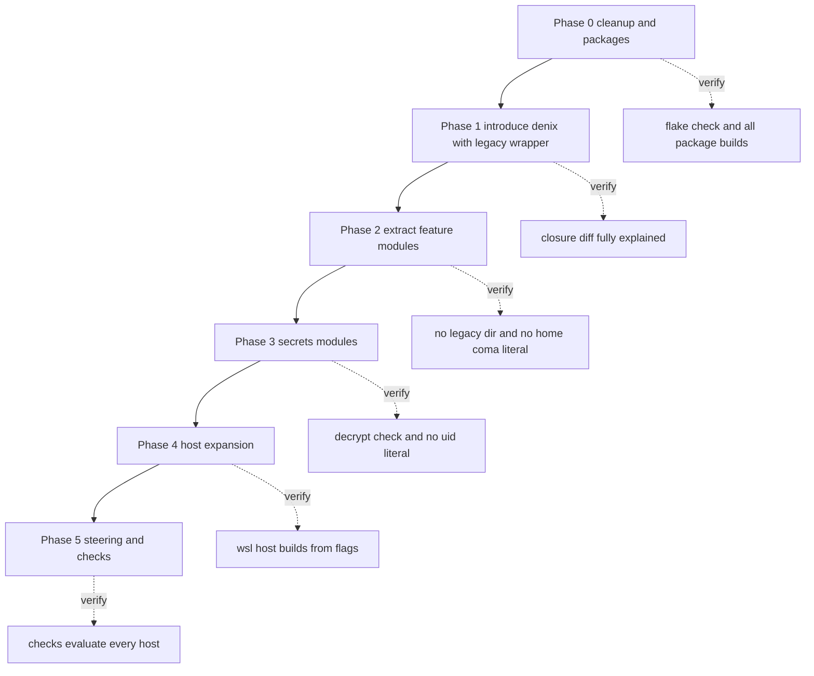

# Technical Design Document

## Overview

**Purpose**: 本移行は、ホストごとの巨大な単一 attrset として存在する Nix 設定を、
[denix](https://github.com/yunfachi/denix) の `delib.module` / `delib.host` 方式による
機能単位のモジュール群へ置き換える。これにより「1機能の変更 = 1ファイルの変更」を成立させ、
新規ホスト追加を既存ファイルのコピーからフラグ宣言へ変える。

**Users**: リポジトリ保守者 (単独) と、本リポジトリを編集する coding agent。後者にとっては
「どのファイルに何を書くか」の判断が機械的に決まることが価値になる。

**Impact**: 現行の `configuration.nix` (719行) / `home.nix` (1143行) /
`home-manager/wsl/default.nix` (854行) / `raspi/configuration.nix` (289行) を解体し、
`modules/` 配下の機能モジュールと `hosts/` 配下のフラグ宣言へ再配置する。
flake output の名前空間 (`nixosConfigurations.<host>`, `homeConfigurations."<user>@<host>"`) が
変わるため、現行の `.#Home` 等はエイリアスとして維持する。

### Goals

- 1機能をシステム側 (`nixos.*`) と home 側 (`home.*`) を含めて1ファイルに閉じる
- ホスト定義を「フラグ + ハードウェア固有設定 + stateVersion」のみに縮退させる
- `pkgs/` の自作パッケージを `callPackage` 規約の overlay + flake `packages` として一元化する
- `/home/coma` リテラルと impure な `builtins.fetchTarball` を排除し pure eval を回復する
- secret の宣言を消費モジュールと同一ファイルに閉じ、uid リテラルと平文複製を排除する
- 各フェーズ末で `nix flake check` / `nixos-rebuild build` / `home-manager build` が通る状態を保つ
- 成功基準: Phase 5 完了時点で `_legacy` が存在せず、全ホストが `checks` でビルド検証される

### Non-Goals

- `config/` 配下の素の dotfiles (niri, nvim, fish 等の設定ファイル本体) の内容変更
- Emacs 設定 (`emacs.d/`, `init.el`) の内容変更
- mac 実機向けホスト定義および `darwinConfigurations` output の追加
  (本移行は `darwin.*` を記述可能な構造の整備までとする)
- WSL ホストの廃止 (維持し、フォークからフラグ構成へ移す)
- sops 復号鍵方式の一本化 (NixOS 側 SSH ホスト鍵 / home 側 age 鍵の双方を維持)
- blueprint / flake-parts の併用 (評価結果は `research.md` を参照)
- 新規パッケージの追加および既存パッケージのバージョン更新

## Architecture

### Existing Architecture Analysis

| 観点 | 現状 | 移行での扱い |
| --- | --- | --- |
| モジュール境界 | 存在しない。`imports` はほぼ空で全設定がホスト単位の attrset | `modules/<category>/<name>.nix` を唯一の境界とする |
| ホスト追加方式 | 既存ファイルのフォーク (WSL が `configuration.nix` / `home.nix` の複製) | `delib.host` のフラグ宣言のみ |
| home-manager 運用 | standalone (`home-manager.nixosModules.home-manager` は無効化済み) | **維持**。`useHomeManagerModule = false` で実現 |
| パッケージ集約 | `packages/*.nix` が `{pkgs}: with pkgs; [...]` を返す関数。`++` で連結 | option を持つ `modules/bundles/*.nix` へ |
| 自作パッケージ | `pkgs/*/default.nix` が `{ pkgs }:` 規約。8箇所から ad-hoc に `import` | `callPackage` 規約 + overlay + `packages` output |
| overlay 適用 | `flake.nix` の `let` で定義し構成ごとに `nixpkgs.overlays` へ注入 | `overlays/` へ切り出し、`*.always.nixpkgs.overlays` で適用 |
| 評価純粋性 | `configuration.nix` に `builtins.fetchTarball` 2件 | flake input へ置換 |
| アイデンティティ | `/home/coma` が6ファイル24箇所 | `myconfig.constants` から導出 |
| secret | 消費側ファイルに埋め込み。`/run/user/1000` 直書き、平文 `cp` + `chmod` | 消費モジュール内宣言 + 既定パス利用 |
| テーマ | `catppuccin.*` が NixOS/home 両方に散在 | `rices/catppuccin-mocha` へ |

**維持すべき統合点**: 2段適用の運用 (`nixos-rebuild switch` + `home-manager switch`)、
`homeConfigurations` の既存名 (`Home` / `coma` / `coma@comabook` / `WSL`)、
`deploy.nodes.raspi` による deploy-rs 経由のリモート適用、`treefmt` による formatter/checks、
`config/` 配下への out-of-store symlink 方式 (編集が即反映される現行の利便性)。

### Architecture Pattern & Boundary Map

**Selected pattern**: denix の 3 層構成 (Host 宣言層 / Feature モジュール層 / 共有定数・rice 層) に、
flake output 層を薄く重ねる。ホストはフラグのみを宣言し、各モジュールが自身の有効条件を保持する
「逆依存」構造を取る。これにより新規ホストの追加が既存モジュールへの変更を伴わない。



**Architecture Integration**:

- **ドメイン境界**: モジュールのカテゴリが境界。`core` は全ホスト共通の基盤、`hardware` は物理デバイス、
  `desktop` はグラフィカルセッション、`programs` はユーザー向けアプリ、`services` は常駐サービス、
  `bundles` はパッケージ集合、`secrets` は機密情報。1ファイルは1カテゴリにのみ属する。
- **依存方向**: Host → (フラグ) → Feature、Feature → Shared、Feature → Overlays。
  Feature 間の直接依存は禁止し、共有が必要な値は `myconfig.constants` か rice を経由する。
- **維持するパターン**: standalone home-manager、out-of-store symlink、treefmt、deploy-rs。
- **新規要素の根拠**: `overlays/` は現行 `flake.nix` の `let` に埋まった overlay を単体評価可能に
  するため。`rices/` はテーマ設定が NixOS/home に散在する現状を1箇所へ集約するため。

### Technology Stack

| Layer | Choice / Version | Role in Feature | Notes |
| --- | --- | --- | --- |
| モジュールフレームワーク | `github:yunfachi/denix` (master) | `delib.module` / `delib.host` / `delib.rice` によるモジュール層 | `nixpkgs` / `home-manager` を本リポジトリの input に `follows` させる |
| denix 拡張 | `denix.lib.extensions.base`, `.args` | ホストの `type` / `features` オプション生成、`host` をモジュール引数へ注入 | `hosts.nix` の自前実装が不要 |
| システム構成 | NixOS (nixpkgs-unstable) | `nixosConfigurations.<host>` | 既存のまま |
| ユーザー構成 | home-manager (standalone) | `homeConfigurations."<user>@<host>"` | `useHomeManagerModule = false` |
| 機密情報 | sops-nix | NixOS = SSH ホスト鍵、home = age 鍵 | 双方維持 (利用者決定) |
| パッケージ集約 | `lib.packagesFromDirectoryRecursive` | `pkgs/` → overlay + `packages` output | nixpkgs lib に存在を確認済み |
| フォーマッタ | treefmt-nix | `formatter` / `checks.format` | 既存のまま |
| リモート適用 | deploy-rs | `deploy.nodes.raspi` | 既存のまま |
| darwin | (構造のみ) | `darwin.*` セクションの記述と home ディレクトリ導出 | `nix-darwin` input は追加しない |

## Requirements Traceability

| Requirement | Summary | Components | Interfaces | Flows |
| --- | --- | --- | --- | --- |
| 1.1-1.7 | 段階的移行と各フェーズの検証 | Migration Phases, Flake Entrypoint | `checks.<system>` | Migration Strategy |
| 2.1-2.5 | pure eval 回復 | Flake Entrypoint | 既存 `nixpkgs` input への一本化 | Phase 0 |
| 3.1-3.7 | デッドコード除去 | Migration Phases | — | Phase 0 |
| 4.1-4.7 | `callPackage` 化と `packages` 公開 | Overlay Set, Local Package Set | `overlays.default`, `packages.<system>` | Phase 0 |
| 5.1-5.7 | denix 導入と standalone HM 維持 | Flake Entrypoint, Legacy Wrapper | `denix.lib.configurations`, alias map | Phase 1 |
| 6.1-6.7 | 機能単位分割 | Feature Module (canonical contract) | `delib.module` セクション契約 | Phase 2 |
| 7.1-7.6 | 定数化とマルチプラットフォーム | Constants Module, Home Identity Module, User Module | `myconfig.constants` | Phase 2 |
| 8.1-8.6 | ホストフラグ | Host Definition, Flag Schema | `myconfig.host.*` | Phase 1-2 |
| 9.1-9.6 | パッケージ束の option 化 | Bundle Module | `myconfig.bundles.<name>.enable` | Phase 2 |
| 10.1-10.11 | sops セキュア化 | Secrets Base Module, 各消費モジュール | `sops.secrets` / `sops.templates` | Phase 3 |
| 11.1-11.6 | WSL フラグ化 / darwin 構造 | Host Definition, Home Identity Module | `defaultFeatures` 上書き | Phase 4 |
| 12.1-12.7 | 構造規約と自動検証 | Steering Document, Flake Entrypoint | `checks.<system>.<host>` | Phase 5 |

## System Flows

### 構成評価フロー

`denix.lib.configurations` は `moduleSystem` ごとに独立した構成集合を生成する。
`useHomeManagerModule = false` のため、`home.*` セクションは NixOS 構成へ一切流れない。



**Key decisions**:

- 全ホスト定義はどの構成の評価時にも読まれる。ホスト定義にはオプション値のみを置き、
  パッケージ参照を持ち込まない (aarch64 のホスト定義が x86_64 構成の評価を壊さないため)。
- `homeConfigurations` の名前は denix が `<user>@<host>` に固定するため、
  現行名は flake 側のエイリアス写像で補う。

### モジュールの有効条件解決



**Key decisions**: フラグの差し引きは `features` の追加では表現できないため、
`defaultFeatures` をホスト側で明示的に上書きする方式を採る (WSL が該当)。

## Components and Interfaces

| Component | Domain/Layer | Intent | Req Coverage | Key Dependencies (P0/P1) | Contracts |
| --- | --- | --- | --- | --- | --- |
| Flake Entrypoint | Flake Output | denix 呼び出しと全 output の公開 | 1, 2, 5, 12 | denix (P0), Overlay Set (P0) | Service, State |
| Overlay Set | Flake Output | overlay の単体評価可能化と順序固定 | 2, 4 | Local Package Set (P0) | Service |
| Local Package Set | Flake Output | `pkgs/` の `callPackage` 化 | 4 | nixpkgs lib (P0) | Service |
| Constants Module | Shared | 単一の真実源となる定数 | 7 | — | State |
| Flag Schema | Host | `type` / `features` の定義 | 8, 11 | base 拡張 (P0) | State |
| Host Definition | Host | ホスト1台の宣言 | 1, 8, 11 | Flag Schema (P0) | State |
| Home Identity Module | Shared | `home.username` / `homeDirectory` の導出 | 7, 11 | Constants Module (P0) | State |
| User Module | Core | NixOS / darwin のユーザー定義 | 7 | Constants Module (P0) | State |
| Feature Module | Feature | 機能1件の正準契約 | 6, 9 | Constants Module (P1), Overlay Set (P1) | Service, State |
| Bundle Module | Feature | パッケージ束 | 9 | Overlay Set (P0) | State |
| Secrets Base Module | Secrets | 復号鍵と既定値 | 10 | sops-nix (P0) | Service, State |
| Legacy Wrapper | Migration | Phase 1 の暫定モジュール | 1, 5 | — | State |
| Rice Definition | Shared | テーマ集約 | 6 | — | State |
| Steering Document | Docs | 構造規約の明文化 | 12 | — | — |

### Flake Output Layer

#### Flake Entrypoint

| Field | Detail |
| --- | --- |
| Intent | `denix.lib.configurations` を呼び出し、構成・パッケージ・checks・devShell を公開する |
| Requirements | 1.2, 1.3, 1.4, 2.1, 2.2, 2.4, 5.1, 5.2, 5.7, 12.5, 12.6 |

**Responsibilities & Constraints**

- denix への引数を1箇所で確定する。フラグ体系 (`features` リスト) の宣言もここに置く
- `homeConfigurations` の現行名をエイリアスとして維持する
- denix が管理しない output (`packages`, `overlays`, `checks`, `devShells`, `formatter`, `deploy`) を公開する
- モジュールの内容をここに書かない。`extensions` と `paths` の宣言のみに留める

**Dependencies**

- Outbound: Overlay Set — `nixpkgs.overlays` へ渡す overlay 集合 (P0)
- External: `denix` — モジュール層の実装 (P0)
- External: `nixpkgs` / `home-manager` — denix の `follows` 先 (P0)
- External: `treefmt-nix`, `deploy-rs` — 既存 output の維持 (P1)

**Contracts**: Service [x] / State [x]

##### Service Interface

```nix
# flake.nix :: mkConfigurations
mkConfigurations :: (moduleSystem :: "nixos" | "home") -> AttrsOf configuration

denix.lib.configurations {
  moduleSystem        :: "nixos" | "home";
  useHomeManagerModule = false;              # standalone HM 維持 (5.2)
  homeManagerUser      = "coma";
  paths                = [ ./hosts ./modules ./rices ];
  extensions           = [ args (base.withConfig { ... }) ];
  specialArgs          = { inherit inputs; };
}
```

- Preconditions: `paths` 配下の全 `.nix` が `delib.module` / `delib.host` / `delib.rice`
  または素の有効なモジュールである
- Postconditions: `nixosConfigurations.<host>` と `homeConfigurations."coma@<host>"` が生成される
- Invariants: `useHomeManagerModule = false` である限り NixOS 構成に `home-manager` オプションは現れない

##### State Management

- **output 名の写像** (Requirement 5.2):

  | 公開名 | 実体 | 用途 |
  | --- | --- | --- |
  | `nixosConfigurations.comabook` | denix 生成 | `nixos-rebuild switch --flake .#comabook` |
  | `nixosConfigurations.raspi` | denix 生成 | deploy-rs |
  | `nixosConfigurations.wsl` | denix 生成 | WSL |
  | `homeConfigurations."coma@comabook"` | denix 生成 | `nh home switch` 自動検出 |
  | `homeConfigurations.Home` | `"coma@comabook"` のエイリアス | 現行 README 手順の維持 |
  | `homeConfigurations.coma` | `"coma@comabook"` のエイリアス | `nh` 自動検出 |
  | `homeConfigurations.WSL` | `"coma@wsl"` のエイリアス | 現行手順の維持 |

- **checks の登録** (Requirement 12.5, 12.6):
  `checks.x86_64-linux` に `format`、`comabook` (= `nixosConfigurations.comabook.config.system.build.toplevel`)、
  `wsl`、`home-comabook` (= `homeConfigurations."coma@comabook".activationPackage`) を登録する。
  `checks.aarch64-linux` に `raspi` を登録する。
  **ビルド経路の分離**: ローカルの `nix flake check` は全システムの checks を評価し、
  x86_64 の checks をビルドする。`checks.aarch64-linux.raspi` のビルドは
  `nix build .#checks.aarch64-linux.raspi` を nixbuild.net のリモートビルダー経由
  (`nix.buildMachines` に既設定) で明示的に実行する。`boot.binfmt` エミュレーションでの
  ローカルビルドは実用的な時間で終わらないため、日常の `nix flake check` の経路には乗せない。

**Implementation Notes**

- Integration: 現行 `flake.nix` の `nixosConfigurations` / `homeConfigurations` ブロックを削除し、
  外部モジュール (`catppuccin`, `niri`, `xremap`, `nix-index-database`, `chaotic`, `nix-ld`,
  `dms`, `hister`, `sops-nix`, `nixos-wsl`, `hermes-agent`, `nixos-hardware`) の `imports` は
  各機能モジュールの `*.always.imports` へ移す
- Validation: Phase 1 で `home-manager build --flake .#Home` と `.#coma@comabook` の双方を実行
- Risks: HM 構成の `pkgs` が `legacyPackages` になるため `allowUnfree` の効き方が変わる。
  失敗する場合は `homeManagerNixpkgs` に `config` 込みの擬似 flake 属性集合を渡す
  (詳細は `research.md` の該当 Decision)

#### Overlay Set

| Field | Detail |
| --- | --- |
| Intent | overlay を単体評価可能なファイルへ切り出し、適用順序を固定する |
| Requirements | 2.2, 2.5, 4.1, 4.7 |

**Responsibilities & Constraints**

- overlay の定義のみを持ち、どのホストで使うかを判断しない
- 適用順序を固定する。`compat` → `inputs` → `nur` → `local-packages`
- `flake.nix` の `let` に overlay を残さない

**Dependencies**

- Outbound: Local Package Set — `pkgs/` の一括登録 (P0)
- External: 各 overlay 提供 input (`neovim-nightly-overlay`, `emacs-overlay`, `nak`, `deno-overlay`,
  `mozilla-overlay`, `niri`, `gleam-overlay`, `llm-agents`, `go-overlay`, `deploy-rs`) (P1)

**Contracts**: Service [x]

##### Service Interface

```nix
# overlays/default.nix
overlays :: { default :: Overlay; compat :: Overlay; inputs :: Overlay;
              nur :: Overlay; local-packages :: Overlay; }

# 構成要素
overlays/compat.nix         # stdenv.is* シャドウ, libdisplay-info_0_2, openldap doCheck=false
overlays/inputs.nix         # input 由来 overlay と個別パッケージ pin (ghostty, xremap, worktrunk, herdr, hunk, lem)
overlays/nur.nix            # final.nur = inputs.nur-packages.legacyPackages.${system}
overlays/local-packages.nix # packagesFromDirectoryRecursive ../pkgs
```

- Preconditions: `inputs` が `specialArgs` 経由で到達する
- Postconditions: `pkgs.<name>` で自作パッケージと pin 済みパッケージが解決する
- Invariants: overlay は副作用として `nixpkgs.config` を変更しない

**Implementation Notes**

- Integration: 現行 workaround コメント (niri-flake#1851 の `libdisplay-info_0_2`、
  `openldap` の `doCheck`、`stdenv.is*` の deprecation シャドウ) を `compat.nix` に移し、
  撤去条件のコメントを維持する
- Validation: `nix eval .#overlays.default` が評価できること
- Risks: overlay 順序に依存した workaround が存在するため、順序を `default.nix` で明示固定する

#### Local Package Set

| Field | Detail |
| --- | --- |
| Intent | `pkgs/` 配下を `callPackage` 規約へ統一し overlay と `packages` output の双方へ供給する |
| Requirements | 4.1, 4.2, 4.3, 4.4, 4.5, 4.6 |

**Responsibilities & Constraints**

- 1パッケージ = `pkgs/<name>/default.nix`。第1引数は `callPackage` が注入する依存のみ
- `homeDirectory` 等の構成依存値を引数に取らない
- `_sources/generated.nix` (nvfetcher 生成) の参照方法は現行を維持する

**Dependencies**

- Inbound: Overlay Set — overlay としての登録 (P0)
- Inbound: Flake Entrypoint — `packages.<system>` としての公開 (P0)
- External: `lib.packagesFromDirectoryRecursive` (P0)

**Contracts**: Service [x]

##### Service Interface

```nix
# 移行前 (13ファイル全てがこの形)
pkgs/<name>/default.nix :: { pkgs, ... } -> derivation

# 移行後
pkgs/<name>/default.nix :: { lib, stdenv, callPackage, <個別依存>, ... } -> derivation
```

- Preconditions: 全パッケージが `callPackage` 規約に適合している
- Postconditions: `nix build .#<name>` が成功する (Requirement 4.3)
- Invariants: パッケージ定義は構成 (`config`) に依存しない

**Implementation Notes**

- Integration: 個別の移行方針
  - `rclone_sync` / `rclone_resync`: `homeDirectory` 引数を廃止し、スクリプト内で `$HOME` を解決する
  - `picoclaw`: `lib` を `callPackage` 経由で受け取る (現行は `pkgs.lib` を明示渡し)
  - `celld` / `terminal-browser`: `package.nix` が既に `callPackage` 形式。`default.nix` のシムを削除
  - `packages/{opensrc,picoclaw,shinycolors-jacket}.nix` の再 export シム3件を削除 (Requirement 4.5)
- Validation: Phase 0 で全13パッケージに対し `nix build .#<name>` を実行
- Risks: `shinycolors-jacket` は現行 `flake.nix` の overlay と `packages/` シムの二重定義。
  overlay 側へ一本化する

### Host Layer

#### Flag Schema

| Field | Detail |
| --- | --- |
| Intent | ホスト種別と機能フラグの語彙を定義する |
| Requirements | 8.3, 8.4, 8.6, 11.2 |

**Responsibilities & Constraints**

- `base` 拡張の設定として `flake.nix` に宣言する。自前の `hosts.nix` は書かない
- フラグの追加は許すが、Phase 2 の切り出し中の削除・改名は行わない (全モジュールへ波及するため)

**Contracts**: State [x]

##### State Management

- **`type`** (`base` 拡張が生成): `desktop` / `laptop` / `server`。
  `isDesktop` / `isLaptop` / `isServer` / `isPC` が自動導出される
- **`features`** (初期集合):

  | feature | 有効時に入る主な内容 |
  | --- | --- |
  | `wayland` | niri, waybar, swaync, xdg portal, wl-clipboard 系 |
  | `gui` | ブラウザ, チャット, 画像編集, SDDM, plasma6 |
  | `dev` | 言語ツールチェイン, LSP, DAP, treefmt |
  | `emacs` | emacs daemon 群, tree-sitter grammar, desktop entry |
  | `agents` | AI エージェント CLI と関連 secret |
  | `media` | spotify, vlc, imv, spotifyd |
  | `container` | docker / podman, lazydocker |
  | `nixbuild` | 分散ビルド, `buildMachines`, cachix |
  | `tailscale` | tailscale |
  | `wsl` | `wsl.enable` および WSL 固有設定 |

- **`defaultByHostType`**:

  | type | defaultFeatures |
  | --- | --- |
  | `desktop` | `wayland`, `gui`, `dev`, `emacs`, `agents`, `media`, `container`, `nixbuild`, `tailscale` |
  | `laptop` | `desktop` と同じ |
  | `server` | `container`, `tailscale` |

- **差し引きの方法**: `features` は加算のみ。減算が必要なホストは `defaultFeatures` を
  明示的に上書きする (WSL が該当)

#### Host Definition

| Field | Detail |
| --- | --- |
| Intent | ホスト1台を宣言する |
| Requirements | 1.6, 8.1, 8.2, 8.5, 11.1, 11.2 |

**Responsibilities & Constraints**

- 記述してよいもの: `name`, `system`, `type`, `features` / `defaultFeatures`, `rice`,
  `homeManagerSystem`, `nixos.system.stateVersion`, `home.home.stateVersion`,
  およびハードウェア固有設定 (`boot.*`, `fileSystems`, `hardware.*`)
- 記述してはならないもの: パッケージリスト、`services.*` の設定、`programs.*` の設定、
  secret 宣言、他ホストにも当てはまる設定
- `hardware-configuration.nix` は素置きできない (`paths` 配下の全 `.nix` が import されるため)。
  `delib.host { name = "<host>"; nixos = { ... }; }` でラップする。同一 `name` の複数宣言はマージされる

**Contracts**: State [x]

##### State Management

```nix
# hosts/comabook/default.nix
delib.host {
  name = "comabook";
  system = "x86_64-linux";
  type = "desktop";
  rice = "catppuccin-mocha";
  nixos.system.stateVersion = "24.05";
  home.home.stateVersion = "24.05";
}

# hosts/comabook/hardware.nix   (nixos-generate-config 出力のラッパ)
delib.host {
  name = "comabook";
  nixos = { boot = { ... }; fileSystems = { ... }; hardware = { ... }; };
}
```

- 各ホストの宣言内容:

  | host | type | features の差分 | 備考 |
  | --- | --- | --- | --- |
  | `comabook` | `desktop` | 既定のまま | `rice = "catppuccin-mocha"` |
  | `raspi` | `server` | `+ agents` | `system = "aarch64-linux"`、sd-image モジュールを `nixos.always.imports` で読む |
  | `wsl` | `desktop` | `defaultFeatures` を `[ dev emacs agents container wsl ]` に上書き | GUI / wayland / media を無効化 (Requirement 11.2) |

**Implementation Notes**

- Integration: `networking.hostName` はホスト名リテラルを書かず `myconfig.host.name` から導出する
  (Requirement 7.5)
- Validation: Requirement 8.6 の検証として、同一フラグ集合の2ホストで
  `config.environment.systemPackages` が一致することを確認する
- Risks: ホスト定義に誤ってパッケージ参照を書くと、他アーキテクチャの構成評価を壊す。
  steering の禁止事項として明記する

### Shared Layer

#### Constants Module

| Field | Detail |
| --- | --- |
| Intent | ユーザー名・パス類の単一の真実源 |
| Requirements | 7.1, 7.2, 7.3, 7.4 |

**Contracts**: State [x]

##### State Management

```nix
# modules/config/constants.nix
options.constants = {
  username      :: readOnly str;   # "coma"
  userFullName  :: readOnly str;
  userEmail     :: readOnly str;
  homeDirectory :: readOnly str;   # darwin なら /Users/${username}、それ以外は /home/${username}
  dotfilesRoot  :: readOnly str;   # "${homeDirectory}/.ghq/github.com/Comamoca/dotfiles"
  binDir        :: readOnly str;   # "${homeDirectory}/.bin"
};
```

- Invariants: `homeDirectory` は `pkgs.stdenv.hostPlatform.isDarwin` で分岐する。
  モジュール内に `/home/coma` および `/Users/coma` のリテラルを書かない (Requirement 7.2)
- `dotfilesRoot` は out-of-store symlink の生成元として全モジュールが参照する (Requirement 7.4)

#### Home Identity Module / User Module

| Field | Detail |
| --- | --- |
| Intent | `home.username` / `home.homeDirectory` と OS 側ユーザー定義を定数から導出する |
| Requirements | 7.1, 7.3, 7.6, 11.4 |

**Contracts**: State [x]

- `modules/config/home.nix`: `home.always` で `home.username` / `home.homeDirectory` を設定
- `modules/config/user.nix`: `nixos.always` で `users.users.<username>` (グループ、
  `extraGroups`、`hashedPasswordFile`) を、`darwin.always` で `users.users.<username>` を設定
- darwin 側セクションは本移行では未検証のまま構造として用意する (Non-Goals 参照)

#### Rice Definition

| Field | Detail |
| --- | --- |
| Intent | テーマ設定を1箇所へ集約する |
| Requirements | 6.1, 6.2 |

**Contracts**: State [x]

- `rices/catppuccin-mocha/default.nix` に `flavor` / `accent` / `wallpaper` と、
  現行 `configuration.nix` / `home.nix` に散在する `catppuccin.*` を集約する
- rice を定義すると構成名に `-<riceName>` が付いた追加の構成が生成される。
  本移行では rice を1個に限定し、ホスト側で `rice = "catppuccin-mocha"` を既定指定する

### Feature Layer

#### Feature Module (正準契約)

| Field | Detail |
| --- | --- |
| Intent | 機能1件をシステム側と home 側を含めて1ファイルに閉じる |
| Requirements | 6.1, 6.2, 6.3, 6.5, 6.6, 9.3 |

**Responsibilities & Constraints**

- ファイル名 = 機能名。`name` は `"<category>.<feature>"` 形式にし、`cfg` の解決パスと一致させる
- 有効条件は自身の `options` で宣言する。ホスト側に条件を書かない (Requirement 8.3)
- **外部モジュールの `imports` は必ず `*.always.imports` に置く。**
  `*.ifEnabled.imports` は infinite recursion になる
- 当該機能の設定ファイル symlink (`config/` への out-of-store symlink) も同一ファイルが持つ
- 他の Feature Module を直接参照しない

**Dependencies**

- Inbound: Flag Schema — 有効条件の判定 (P0)
- Outbound: Constants Module — パス導出 (P1)
- Outbound: Overlay Set — `pkgs.<name>` の解決 (P1)

**Contracts**: Service [x] / State [x]

##### Service Interface

```nix
# modules/<category>/<feature>.nix の正準形
{ delib, pkgs, inputs, ... }:
delib.module {
  name = "<category>.<feature>";

  # 有効条件: フラグから導出する
  options = { myconfig, ... }@args:
    delib.singleEnableOption myconfig.host.<flag>Featured args;

  # 外部モジュールは無条件 import
  nixos.always.imports = [ inputs.<input>.nixosModules.default ];

  # システム側の設定
  nixos.ifEnabled = { ... };

  # home 側の設定 (同一ファイル内)
  home.ifEnabled = { myconfig, ... }: { ... };

  # darwin 側 (必要な場合のみ)
  darwin.ifEnabled = { ... };
}
```

- Preconditions: `options` が `enable` を定義している (`ifEnabled` / `ifDisabled` の前提)
- Postconditions: `myconfig.<category>.<feature>.enable` により当該機能の全設定が一括で切り替わる
- Invariants: 1ファイルが複数カテゴリに跨らない

##### State Management

現行ファイルからの移行先マッピング (Phase 2 の作業単位):

| 移行元 | 移行先 |
| --- | --- |
| `configuration.nix` fonts | `modules/core/fonts.nix` |
| `configuration.nix` nix / buildMachines / ssh knownHosts | `modules/core/nix.nix` (`nixbuild` フラグ) |
| `configuration.nix` time / i18n / console | `modules/core/locale.nix` |
| `configuration.nix` networking / nat / networkmanager | `modules/core/networking.nix` |
| `configuration.nix` nameservers / nextdns | `modules/services/nextdns.nix` |
| `configuration.nix` envfs / nix-ld | `modules/core/runtime-compat.nix` |
| `configuration.nix` boot / kernel / initrd | `hosts/comabook/hardware.nix` |
| `configuration.nix` logind / sleep / powerManagement | `modules/hardware/power.nix` |
| `configuration.nix` bluetooth / blueman | `modules/hardware/bluetooth.nix` |
| `configuration.nix` pipewire / rtkit / pulseaudio | `modules/hardware/audio.nix` |
| `configuration.nix` printing | `modules/hardware/printing.nix` |
| `configuration.nix` input-remapper + `home.nix` wacom/krita activation | `modules/hardware/wacom.nix` |
| `configuration.nix` xserver / xkb | `modules/desktop/xserver.nix` |
| `configuration.nix` sddm / displayManager / plasma6 | `modules/desktop/login.nix` |
| `configuration.nix` xdg.portal | `modules/desktop/portal.nix` |
| `configuration.nix` programs.niri + `home.nix` niri-scratchpad / wl-clip-persist | `modules/desktop/niri.nix` |
| `configuration.nix` programs.sway | `modules/desktop/sway.nix` |
| `hyprland.nix` / `hyprlock.nix` / `home.nix` hyprland | `modules/desktop/_legacy/hyprland.nix` (フラグ無効) |
| `configuration.nix` services.ollama | `modules/services/ollama.nix` |
| `configuration.nix` services.xremap + `xremap.nix` | `modules/services/xremap.nix` |
| `configuration.nix` services.tailscale / keybase | `modules/services/{tailscale,keybase}.nix` |
| `configuration.nix` virtualisation | `modules/services/virtualisation.nix` |
| `configuration.nix` environment.systemPackages | `modules/bundles/system.nix` |
| `configuration.nix` programs.firefox | `modules/programs/firefox.nix` |
| `home.nix` programs.fish + `fish.nix` | `modules/programs/fish.nix` |
| `home.nix` emacs 一式 + `emacs.nix` | `modules/programs/emacs.nix` |
| `home.nix` programs.{foot,alacritty,bat,nix-index} | `modules/programs/<name>.nix` |
| `home.nix` services.spotifyd / hister | `modules/services/{spotifyd,hister}.nix` |
| `home.nix` rclone-sync service + timer | `modules/services/rclone-sync.nix` |
| `home.nix` gpg-agent | `modules/programs/gpg.nix` |
| `home.nix` home.file (336行) | 各機能モジュールへ分配 (当該機能の symlink はその機能が持つ) |
| `home.nix` sessionVariables / sessionPath | `modules/core/session.nix` と各機能モジュール |
| `packages/*.nix` | `modules/bundles/*.nix` |
| `configuration.nix` / `home.nix` catppuccin | `rices/catppuccin-mocha/default.nix` |

**Implementation Notes**

- Integration: `home.file` の分配が Phase 2 で最も行数が大きい (336行)。
  「機能モジュールが自分の設定ファイル symlink を持つ」規約により、分配先は機械的に決まる
- Validation: 各カテゴリの切り出し後に `nixos-rebuild build` の結果パスを移行前と比較する
- Risks: `_legacy` と新モジュールで同一オプションを二重定義すると衝突する。
  切り出し時は `_legacy` からの削除と新モジュールの追加を同一の変更で行う

#### Bundle Module

| Field | Detail |
| --- | --- |
| Intent | パッケージ束を option で切り替える |
| Requirements | 9.1, 9.2, 9.3, 9.4, 9.5, 9.6 |

**Contracts**: State [x]

##### State Management

```nix
# modules/bundles/<name>.nix
delib.module {
  name = "bundles.<name>";
  options = { myconfig, ... }@args:
    delib.singleEnableOption myconfig.host.<flag>Featured args;
  home.ifEnabled.home.packages = with pkgs; [ ... ];
}
```

- `{ pkgs }: with pkgs; [ ... ]` 形式のリスト返し関数を残さない (Requirement 9.2)
- 呼び出し側から `pkgs` 以外の引数を受け取らない。`emacs'` / `nurpkgs` は overlay 経由で
  `pkgs.<name>` / `pkgs.nur.<name>` として解決する (Requirement 9.3)
- 束の配置先:

  | bundle | フラグ | 配置先 |
  | --- | --- | --- |
  | `system` | 常時 | `environment.systemPackages` (Requirement 9.5) |
  | `development` | `dev` | `home.packages` |
  | `editors` | `dev` | `home.packages` |
  | `terminal` | 常時 | `home.packages` |
  | `utilities` | 常時 | `home.packages` |
  | `gui-apps` | `gui` | `home.packages` |
  | `media` | `media` | `home.packages` |
  | `git` | 常時 | `home.packages` |
  | `security` | 常時 | `home.packages` |
  | `wayland` | `wayland` | `home.packages` |
  | `agents` | `agents` | `home.packages` |

- 現行 `packages/misc.nix` は分類不能なパッケージの集積になっているため、
  上記の束へ再分類し `misc` は新設しない

### Secrets Layer

#### Secrets Base Module

| Field | Detail |
| --- | --- |
| Intent | 復号鍵と既定値を集約し、消費側は自分の secret を自分で宣言する |
| Requirements | 10.1-10.11 |

**Responsibilities & Constraints**

- 復号鍵と `defaultSopsFile` のみを持つ。個別 secret の宣言は持たない
- 個別の secret / template は消費モジュールが宣言する (Requirement 10.1)

**Dependencies**

- External: `sops-nix` — NixOS モジュールと home-manager モジュール (P0)

**Contracts**: Service [x] / State [x]

##### Service Interface

```nix
# modules/secrets/default.nix
nixos.always.imports = [ inputs.sops-nix.nixosModules.sops ];
home.always.imports  = [ inputs.sops-nix.homeManagerModules.sops ];

nixos.always.sops.age.sshKeyPaths = [ "/etc/ssh/ssh_host_ed25519_key" ];  # 10.5
home.always.sops.age.keyFile =
  "${myconfig.constants.homeDirectory}/.config/sops/age/keys.txt";        # 10.10
```

- Preconditions: NixOS ホストの SSH ホスト鍵の age 公開鍵が `.sops.yaml` に登録されている
- Postconditions: 消費モジュールは `sops.secrets.<name>` を宣言するだけで復号される
- Invariants: 復号鍵の二系統 (SSH ホスト鍵 / age 鍵) を並行維持する (Requirement 10.11)

##### State Management

- **パス規約** (Requirement 10.2, 10.3): secret の `path` を明示しない。
  home 側は sops-nix 既定の `${xdg.configHome}/sops-nix/secrets/<name>`
  (実体は `$XDG_RUNTIME_DIR/secrets.d` 配下) を使い、消費側は
  `config.sops.secrets.<name>.path` を参照する。`/run/user/1000` リテラルを書かない
- **権限** (Requirement 10.6): NixOS の `sops.templates` には `owner` と `mode` を明示する。
  home-manager の secret / template は `mode` のみ (`owner` オプションが存在しない)
- **`.sops.yaml` の分離** (Requirement 10.7):

  | パス | 鍵グループ |
  | --- | --- |
  | `secrets/hosts/raspi/*` | main age 鍵 + raspi ホスト鍵 |
  | `secrets/hosts/comabook/*` | main age 鍵 + comabook ホスト鍵 |
  | `secrets/home/*` | main age 鍵 |

- **平文経路の除去** (Requirement 10.4): `raspi/configuration.nix` の
  `system.activationScripts.wifi-nmconnection` (平文を `cp` して `chmod 600`) を廃止し、
  `sops.templates` の出力パスを NetworkManager へ直接参照させる
- **パスワード** (Requirement 10.8): raspi の `initialPassword = "changeme"` と
  `security.sudo.wheelNeedsPassword = false` を廃止し、
  `users.users.<name>.hashedPasswordFile = config.sops.secrets."<host>-password".path` とする
- **失敗時の挙動** (Requirement 10.9): secret を要するサービスは
  `systemd.services.<name>.serviceConfig.EnvironmentFile` または
  `unitConfig.ConditionPathExists` で secret のパスに依存させ、復号失敗時に起動しない

**Implementation Notes**

- Integration: `raspi/configuration.nix` の secret / template / systemd unit 一式は
  `modules/services/picoclaw.nix` へ移し、宣言と消費を同一ファイルに閉じる
- Validation: ホスト鍵の age 公開鍵は `ssh-to-age` で取得する。`.sops.yaml` 更新後に
  `sops updatekeys` を各ファイルへ適用する
- Risks: 鍵グループ変更時に再暗号化を忘れると復号不能になる。Phase 3 のタスクで
  `sops updatekeys` の実行と復号確認を対にする

### Migration Layer

#### Legacy Wrapper

| Field | Detail |
| --- | --- |
| Intent | Phase 1 で既存 attrset を設定内容を変えずに denix 構成へ載せる |
| Requirements | 1.6, 1.7, 5.6, 6.4 |

**Contracts**: State [x]

**方式**: `delib.module` + フラグではなく **`delib.host` のホストセクション**を使う。
ホストセクションは `currentHostName` の一致時にのみ適用されるため `lib.mkIf` が不要で、
`imports` を含む attrset をそのまま置ける。`delib.module` の `*.ifEnabled` で囲むと
`imports` が infinite recursion になるため、この方式でなければ Phase 1 が成立しない
(raspi は `imports = [ "${modulesPath}/installer/sd-card/sd-image-aarch64.nix" ... ]` を持つ)。

```nix
# modules/_legacy/comabook-nixos.nix
{ delib, pkgs, inputs, lib, config, ... }:
let
  # 現行 configuration.nix の let ブロックを移設
in
delib.host {
  name = "comabook";
  nixos = { ... 現行 configuration.nix の本体 ... };
}
```

- `modules/_legacy/comabook-nixos.nix`: 現行 `configuration.nix` の本体を
  `delib.host { name = "comabook"; nixos = <現行 attrset>; }` に載せる
- `modules/_legacy/comabook-home.nix`: 現行 `home.nix` を
  `delib.host { name = "comabook"; home = <現行 attrset>; }` に載せる
- `modules/_legacy/raspi.nix`: 現行 `raspi/configuration.nix` を
  `delib.host { name = "raspi"; nixos = <現行 attrset>; }` に載せる
- `modules/_legacy/wsl-home.nix`: 現行 `home-manager/wsl/default.nix` を
  `delib.host { name = "wsl"; home = <現行 attrset>; }` に載せる
- **機械的コピーにならない箇所** (Phase 1 のタスクで明示する):
  - `home.nix` は 195行の `let` ブロックを持ち、本体が `rec` で自己参照している
    (`home.file` の let が `home.homeDirectory` を参照)。`let` はファイル先頭へ移し、
    `rec` 本体をそのまま `home` セクションへ渡す
  - `configuration.nix` / `home.nix` の `stateVersion` と
    `hardware-configuration.nix` はラップ対象から外し、ホスト定義 (`hosts/<host>/`) へ移す
  - `configuration.nix` の `imports` にある `nixos-hardware` 系はそのまま
    ホストセクションの `imports` に残す
- `exclude` は使わない。ファイルが存在するのに無効という状態は agent の誤読を招く
- Phase 2 の各タスクで `_legacy` から該当部分を削除する。Phase 2 完了時に
  `modules/_legacy/` はディレクトリごと削除される (Requirement 6.4)

### Documentation Layer

#### Steering Document

| Field | Detail |
| --- | --- |
| Intent | 構造上の判断規則を coding agent が参照できる形で固定する |
| Requirements | 12.1, 12.2, 12.3, 12.4, 12.7 |

- `.kiro/steering/structure.md` に記載する項目:
  1. 1機能 = 1ファイル。配置は `modules/<category>/<name>.nix`
  2. 新機能の追加手順は「`modules/<category>/` にファイルを1つ追加する」のみ
  3. `imports` を手書きしない (`paths` 配下は自動発見される)
  4. **外部モジュールの `imports` は `*.always.imports` に置く。`*.ifEnabled.imports` は
     infinite recursion になる**
  5. ホスト定義に書いてよいもの / 書いてはならないものの一覧 (Host Definition 節の表)
  6. システム側と home 側は同一ファイルの `nixos.*` / `home.*` に書く
  7. カテゴリの定義と、どのカテゴリに何が属するか
- `.kiro/steering/tech.md` / `product.md` は現在不在のため、本移行に合わせて新規作成する
- `README.md` の適用コマンドを移行後の構成名に合わせる (Requirement 12.7)

## Data Models

### Domain Model

denix の `myconfig` 名前空間が本移行における唯一の設定ドメインモデルとなる。



**Business rules & invariants**

- `myconfig.constants.*` は `readOnly`。ホストやモジュールから再代入されない
- `myconfig.host` は現在評価中のホストの `myconfig.hosts.<name>` を指す
- `<feature>Featured` は `features ++ defaultFeatures` に当該 feature が含まれるとき真
- 各機能モジュールの `enable` は既定値としてフラグを参照し、ホスト側での明示上書きも可能

### Logical Data Model

| 属性パス | 型 | 既定値 | 設定元 |
| --- | --- | --- | --- |
| `myconfig.constants.username` | `readOnly str` | `"coma"` | Constants Module |
| `myconfig.constants.homeDirectory` | `readOnly str` | プラットフォーム分岐 | Constants Module |
| `myconfig.constants.dotfilesRoot` | `readOnly str` | `homeDirectory` から導出 | Constants Module |
| `myconfig.hosts.<name>.type` | `enum [desktop laptop server]` | 既定なし (必須) | Host Definition |
| `myconfig.hosts.<name>.features` | `listOf (enum features)` | `[]` | Host Definition |
| `myconfig.hosts.<name>.defaultFeatures` | `listOf (enum features)` | `defaultByHostType.<type>` | Flag Schema / Host Definition |
| `myconfig.hosts.<name>.system` | `nullOr str` | `null` | Host Definition |
| `myconfig.<category>.<feature>.enable` | `bool` | 対応フラグ | Feature Module |

**Consistency & Integrity**

- ホスト名の整合性は `base` 拡張の `hostNamesAssertions` が検証する
  (`hosts` の属性名と `delib.host :: name` の一致)
- `features` に未定義の feature 名を書くと `enum` 型で評価時エラーになる。
  これがフラグ語彙のタイプセーフティを担保する

## Error Handling

### Error Strategy

本移行の誤りは全て Nix の評価時またはビルド時に現れる。実行時エラーの経路は持たない。
したがって「各フェーズ末で評価とビルドを通す」ことが唯一かつ十分な検証手段となる
(Requirement 1.2-1.5)。

### Error Categories and Responses

| 分類 | 代表的な症状 | 対応 |
| --- | --- | --- |
| 評価エラー (構文・型) | `features` の未定義名、`enum` 違反、ホスト名不整合 | `nix flake check` で検出。該当モジュールを修正 |
| 評価エラー (infinite recursion) | `*.ifEnabled.imports` の使用 | `*.always.imports` へ移す。steering に明記済み |
| オプション衝突 | `_legacy` と新モジュールの二重定義 | 切り出しと削除を同一変更で行う。`lib.mkForce` での回避は行わない |
| impure 評価エラー | `builtins.fetchTarball` 残存 | Phase 0 で flake input へ置換 (Requirement 2.1) |
| unfree ブロック | HM 構成の `pkgs` が `legacyPackages` になる影響 | `nixpkgs.config.allowUnfree` で解決。不可の場合は `homeManagerNixpkgs` を差し替え |
| ビルドエラー (クロス) | ホスト定義にパッケージ参照を書いた場合 | ホスト定義の禁止事項として steering に明記 |
| secret 復号失敗 | 鍵グループ変更後の `sops updatekeys` 漏れ | Phase 3 のタスクで再暗号化と復号確認を対にする |
| 適用後の機能欠落 | フラグの付け忘れによる無効化 | フェーズ末に移行前後のビルド結果パスを比較する |

### Monitoring

- `nix flake check` が全ホストの評価と toplevel ビルドを兼ねる (Requirement 12.5, 12.6)
- `nix store diff-closures` による移行前後の closure 差分確認を各フェーズ末の手順に含める

## Testing Strategy

本リポジトリはユニットテストを持たないため、検証は評価・ビルド・差分比較で行う。

### 評価テスト (各フェーズ末に必須)

- `nix flake check` — 全 output の評価と登録済み checks のビルド
- `nix eval .#nixosConfigurations.<host>.config.system.build.toplevel.drvPath` — 全ホスト分
- `nix eval .#overlays.default` — overlay の単体評価
- `nix build .#<package>` — `pkgs/` 配下13パッケージ (Phase 0, Requirement 4.3)

### ビルドテスト (各フェーズ末に必須)

- `nixos-rebuild build --flake .#comabook`
- `nixos-rebuild build --flake .#wsl`
- `nix build .#checks.aarch64-linux.raspi` (aarch64。nixbuild.net のリモートビルダー経由。
  `boot.binfmt` でのローカルビルドは時間がかかりすぎるため用いない)
- `home-manager build --flake .#Home` および `.#coma@comabook`

### 差分テスト (回帰検出)

- `nix store diff-closures <移行前の toplevel> <移行後の toplevel>` — comabook の
  システムと home の双方 (Requirement 1.6)
- Phase 1 では closure の完全一致を期待しない。denix 化により HM 構成の `pkgs` が
  `import nixpkgs { config.allowUnfree = true; }` から `legacyPackages.<system>` + `nixpkgs.config`
  の再 import へ変わり、nixpkgs インスタンスが別物になるため。`nixpkgs.hostPlatform` の設定元が
  `base` 拡張へ移る影響も加わる
- 全フェーズ共通の完了条件は「差分を列挙し、各差分の原因を説明できること」とする。
  説明できない差分が1件でもあれば当該フェーズ内で原因を特定する

### 構造テスト

- `modules/_legacy/` の不在確認 (Phase 2 完了、Requirement 6.4)
- `rg '/home/coma' --type nix` が 0 件 (Phase 2 完了、Requirement 7.2)
- `rg 'run/user/1000' --type nix` が 0 件 (Phase 3 完了、Requirement 10.2)
- `rg 'builtins.fetchTarball' --type nix` が 0 件 (Phase 0 完了、Requirement 2.1)
- `rg 'ifEnabled' -A3 --type nix | rg imports` が 0 件 (全フェーズ)

## Security Considerations

本移行に固有のセキュリティ上の決定のみを記載する。

- **鍵の二系統維持**: NixOS ホストは SSH ホスト鍵で復号し、age 秘密鍵の手配布を不要にする。
  home 構成は既存の age 鍵 (`~/.config/sops/age/keys.txt`) を維持する。
  これは利用者の決定であり、移行リスクを最小化する選択である
- **侵害影響の限定**: `.sops.yaml` の creation_rules をホスト単位に分離することで、
  1台の鍵が漏洩した際に復号可能な secret の範囲をそのホストのものに限定する
  (現行は `secrets/*` が main 鍵1本で一括暗号化されている)
- **平文経路の削減**: 平文 secret をファイルシステムへ複製する activationScript を廃止し、
  sops-nix が管理する tmpfs 上のパスを直接参照させる。復号世代の実体は
  `$XDG_RUNTIME_DIR/secrets.d` (home) および `/run/secrets.d` (NixOS) に置かれる
- **平文パスワードの排除**: `initialPassword` / `wheelNeedsPassword = false` を廃止し
  `hashedPasswordFile` を用いる
- **公開リポジトリ前提**: 本リポジトリは公開されている。SSH 公開鍵とホスト名の記載は継続して
  問題ないが、secret 宣言の追加時に平文が混入しないことをフェーズ完了時に確認する

## Migration Strategy



| Phase | 内容 | 完了条件 | ロールバック契機 |
| --- | --- | --- | --- |
| **0** | デッドコード削除 (`agent.nix`, `hosts/wsl/`, `catppuccin.nix`, `containers.nix`)、`builtins.fetchTarball` 2件の撤去 (下記参照)、`pkgs/` を `callPackage` 化、`overlays/` 切り出し、`packages` output 公開、シム3件削除 | 全13パッケージの `nix build` 成功、`nix flake check --no-impure` 成功、comabook の closure 差分が overlay 起因のみ | パッケージのビルド不能、closure に予期しない差分 |
| **1** | denix 導入、`hosts/{comabook,raspi,wsl}` 作成、`modules/config/{constants,home,user}.nix` 作成、既存設定を `modules/_legacy/` へラップ、`homeConfigurations` エイリアス層追加 | 全ホストの build 成功、`.#Home` / `.#coma@comabook` の双方が build 可能、comabook の closure 差分を列挙し各差分が nixpkgs インスタンス変更または overlay 適用点変更に起因すると説明できる | 説明できない closure 差分、`allowUnfree` が解決できない |
| **2** | `_legacy` から機能単位で切り出し。順序は `core` → `hardware` → `programs` → `services` → `bundles` → `desktop` → `home.file` の分配 | `modules/_legacy/` 不在、`/home/coma` リテラル 0 件、各カテゴリ切り出し時点で build 成功 | カテゴリ単位で切り戻す (1タスク1カテゴリのため影響範囲が閉じる) |
| **3** | `modules/secrets/` 作成、secret 宣言を消費モジュールへ移動、`.sops.yaml` ホスト別分離、`sops updatekeys`、平文 activationScript 廃止、`hashedPasswordFile` 化 | `/run/user/1000` リテラル 0 件、raspi 実機での復号確認、平文複製スクリプト 0 件 | 復号不能 (鍵グループを元に戻し再暗号化) |
| **4** | WSL を `defaultFeatures` 上書きで表現し `home-manager/wsl/default.nix` を削除、darwin 構造の整備 (`darwin.*` セクションと `homeDirectory` 分岐の確認) | WSL の build がフラグのみで成立、重複設定 0 件 | WSL 構成を Phase 3 時点へ戻す |
| **5** | `.kiro/steering/{structure,tech,product}.md` 作成、`checks` に全ホスト登録、`README.md` 更新 | `nix flake check` が全ホストの構成を評価し x86_64 ホストをビルド、`checks.aarch64-linux.raspi` がリモートビルダー経由でビルド成功、steering に7項目が記載済み | — |

**Phase 0 の impure 撤去の詳細** (Requirement 2.1, 2.2)

`configuration.nix` の `builtins.fetchTarball` 2件は、いずれも新規 flake input を必要としない。
実測の結果、新たな pin の追加ではなく撤去と既存 input への一本化で解決する。

| 対象 | 実測結果 | 対応 |
| --- | --- | --- |
| `old-pkgs` (L18) | `hyprland-0-35-0` (L28) の定義にのみ使われ、`hyprland-0-35-0` 自体は参照 0 件 | 両方削除。代替不要 |
| `unstable-pkgs` (L23) | `services.ollama.package` (L250) で使用中。ただし本リポジトリの `nixpkgs` input は既に `nixpkgs-unstable` であり重複取得 | `pkgs.ollama` へ置換 |
| `hosts/wsl/default.nix` の `old-pkgs` (L10) | ファイル自体が未参照のデッドコード | ファイルごと削除 |

したがって Requirement 2.2 (旧版 nixpkgs を input として宣言) は該当ケースが存在せず、
vacuously 充足される。`flake.lock` に新規エントリは追加されない。

**フェーズ間の原則** (Requirement 1.5, 1.7)

- あるフェーズの検証が失敗した場合、次フェーズへ進まず当該フェーズ内で修正する
- 機能追加・パッケージ更新を移行の変更に混ぜない。設定の改善は Phase 5 完了後に行う
- 各フェーズは独立したコミット可能な単位とし、Phase 2 は更にカテゴリ単位のタスクへ分割する

## Supporting References

- 調査記録・代替案の評価・設計判断の根拠は `.kiro/specs/denix-module-migration/research.md` に記載
- denix の API 詳細 (`delib.configurations` の全引数、`delib.host` のフィールド、
  `base` 拡張が生成するオプション) は `research.md` の Research Log を参照
- `*.ifEnabled.imports` が infinite recursion になる理由と公式の回避策は
  `research.md` の該当 Research Log を参照
