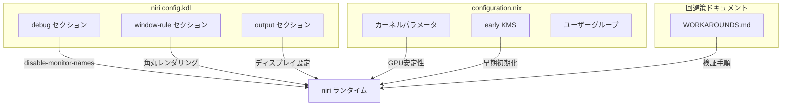
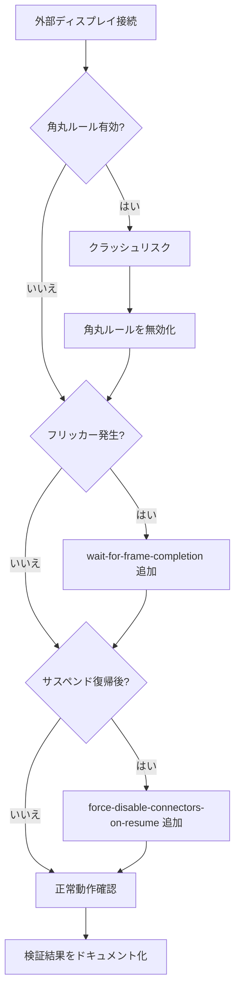

# 設計ドキュメント

## 概要
**目的**: niriウィンドウマネージャで外部ディスプレイが映らない・クラッシュする問題を、設定ファイルの修正と回避策の整理により解決する。
**対象ユーザー**: ノートPCと外部ディスプレイを併用するデスクトップユーザー。
**影響**: `config/niri/config.kdl` のウィンドウルール・デバッグ設定の変更、および `configuration.nix` のコメント整理。

### ゴール
- 外部ディスプレイのホットプラグ時にniriがクラッシュせず安定動作すること
- 既知のクラッシュ原因（角丸レンダリング等）を排除すること
- 回避策の文書化と将来の削除手順を提供すること

### 非ゴール
- niri本体のソースコード修正
- GPUドライバの変更やカーネルのカスタムビルド
- 完全なマルチモニターレイアウト管理機能の実装

## アーキテクチャ

### 既存アーキテクチャ分析
- **config/niri/config.kdl**: niriの設定ファイル。KDL形式で記述
  - `debug { disable-monitor-names }` が既に適用済み
  - `geometry-corner-radius 12` + `clip-to-geometry true` のウィンドウルールが有効（コメントでクラッシュ問題を示唆しつつも無効化されていない）
  - `prefer-no-csd` は無効（コメントアウト状態）
  - `output "eDP-1"` はコメントアウト済み（`/-`）
- **configuration.nix**: NixOS設定
  - i915カーネルパラメータ（PSR/FBC/DC無効化）が適用済み
  - early KMS有効化済み
  - ユーザーがvideoグループに追加済み

### アーキテクチャパターンとバウンダリマップ

**アーキテクチャ統合**:
- 選択パターン: 設定ファイルベースの段階的回避策適用
- 境界: niri設定（config.kdl）とNixOS設定（configuration.nix）は独立して変更可能
- 既存パターン維持: KDL設定のコメント規約、NixOSの宣言的設定
- 新規コンポーネント: 回避策の検証手順ドキュメント（WORKAROUNDS.md）

### テクノロジースタック

| レイヤー | 選択 / バージョン | フィーチャーでの役割 | 備考 |
|---------|-----------------|-------------------|------|
| ウィンドウマネージャ | niri (niri-flake経由) | メイン対象 | unstable版を使用中 |
| 設定形式 | KDL | config.kdl編集 | — |
| OS設定 | NixOS / configuration.nix | カーネルパラメータ管理 | 変更なし（コメント整理のみ） |
| GPU | Intel i915 | ディスプレイ出力 | カーネルパラメータ適用済み |

## システムフロー

## 要件トレーサビリティ

| 要件 | 概要 | コンポーネント | インターフェース | フロー |
|------|------|--------------|----------------|-------|
| 1.1 | 外部ディスプレイ接続時のクラッシュ防止 | NiriConfigDebug, NiriConfigWindowRule | config.kdl debug/window-rule | ホットプラグフロー |
| 1.2 | 切断時のクラッシュ防止 | NiriConfigDebug | config.kdl debug | ホットプラグフロー |
| 1.3 | 異なるスケーリング環境での安定動作 | NiriConfigWindowRule | config.kdl window-rule | ホットプラグフロー |
| 2.1 | 角丸設定のクラッシュ回避 | NiriConfigWindowRule | config.kdl window-rule | — |
| 2.2 | 角丸ルールの無効化と理由コメント | NiriConfigWindowRule | config.kdl window-rule | — |
| 2.3 | prefer-no-csdの無効維持 | NiriConfigWindowRule | config.kdl | — |
| 3.1 | debug設定のコメント文書化 | NiriConfigDebug | config.kdl debug | — |
| 3.2 | カーネルパラメータのコメント文書化 | NixOSConfig | configuration.nix | — |
| 3.3 | 回避策の検証手順文書化 | WorkaroundDoc | WORKAROUNDS.md | 段階的検証フロー |
| 4.1 | output設定の適切な構成 | NiriConfigOutput | config.kdl output | — |
| 4.2 | eDP-1デフォルト設定での動作 | NiriConfigOutput | config.kdl output | — |
| 4.3 | niri msg outputsでの確認 | NiriConfigOutput | config.kdl output | — |

## コンポーネントとインターフェース

| コンポーネント | ドメイン/レイヤー | 意図 | 要件カバー | 主要依存関係 | コントラクト |
|--------------|----------------|------|-----------|------------|------------|
| NiriConfigDebug | niri設定 | デバッグオプションの管理 | 1.1, 1.2, 3.1 | niriランタイム (P0) | State |
| NiriConfigWindowRule | niri設定 | ウィンドウルール（角丸等）の管理 | 1.3, 2.1, 2.2, 2.3 | niriレンダラー (P0) | State |
| NiriConfigOutput | niri設定 | ディスプレイ出力設定 | 4.1, 4.2, 4.3 | DRMデバイス (P0) | State |
| NixOSConfig | NixOS設定 | カーネルパラメータのコメント整理 | 3.2 | i915ドライバ (P0) | — |
| WorkaroundDoc | ドキュメント | 回避策の検証手順 | 3.3 | — | — |

### niri設定レイヤー

#### NiriConfigDebug

| フィールド | 詳細 |
|-----------|------|
| 意図 | niri debugセクションの設定変更と文書化 |
| 要件 | 1.1, 1.2, 3.1 |

**責務と制約**
- `disable-monitor-names` の維持/削除判断
- `wait-for-frame-completion-before-queueing` の追加検討
- `force-disable-connectors-on-resume` の追加検討
- 各デバッグオプションの目的をコメントで明記

**依存関係**
- Outbound: niriランタイム — デバッグ動作の制御 (P0)

**コントラクト**: State [x]

##### State Management
- 設定状態: KDLファイルの `debug {}` セクション
- 現在の状態: `disable-monitor-names` のみ有効
- 目標状態: 必要なデバッグオプションが有効化され、各オプションにコメントで理由が記載

**実装メモ**
- 統合: config.kdlの先頭にある `debug {}` セクションを編集
- 検証: `niri validate` コマンドで設定の妥当性を確認
- リスク: デバッグオプションはniriのリリースポリシー対象外のため、バージョンアップ時に動作が変わる可能性

#### NiriConfigWindowRule

| フィールド | 詳細 |
|-----------|------|
| 意図 | 角丸ウィンドウルールの無効化とクラッシュ回避 |
| 要件 | 1.3, 2.1, 2.2, 2.3 |

**責務と制約**
- `geometry-corner-radius 12` + `clip-to-geometry true` のウィンドウルールを `/-` でコメントアウト
- コメントアウトの理由を日本語コメントで明記
- `prefer-no-csd` が無効のまま維持されていることを確認

**依存関係**
- Outbound: niriレンダラー — ウィンドウ描画の制御 (P0)

**コントラクト**: State [x]

##### State Management
- 設定状態: KDLファイルの `window-rule {}` セクション
- 現在の状態: 角丸ルールが有効（コメントで問題を示唆しつつも無効化されていない矛盾あり）
- 目標状態: 角丸ルールが `/-` でコメントアウトされ、理由が明記

**実装メモ**
- 統合: 既存の角丸window-ruleブロックの前に `/-` を追加
- 検証: 外部ディスプレイ接続時にクラッシュしないことを確認
- リスク: 角丸が無効になるためビジュアルが変化する

#### NiriConfigOutput

| フィールド | 詳細 |
|-----------|------|
| 意図 | 外部ディスプレイの出力設定が適切であることを確認 |
| 要件 | 4.1, 4.2, 4.3 |

**責務と制約**
- eDP-1のoutput設定は現在のコメントアウト状態を維持（niriの自動検出に委ねる）
- 外部ディスプレイ用のoutput設定は明示的に追加しない（自動検出を利用）

**依存関係**
- Outbound: DRMデバイス — ディスプレイ出力 (P0)

**コントラクト**: State [x]

##### State Management
- 設定状態: KDLファイルの `output` セクション
- 現在の状態: eDP-1がコメントアウト済み、外部ディスプレイ用設定なし
- 目標状態: 変更なし（現状維持が適切）

**実装メモ**
- 統合: 変更不要。現在の設定で自動検出が機能するはず
- 検証: `niri msg outputs` コマンドで出力一覧を確認
- リスク: 特定の外部モニターで自動検出が失敗する場合は個別のoutput設定が必要になる

### NixOS設定レイヤー

#### NixOSConfig

| フィールド | 詳細 |
|-----------|------|
| 意図 | カーネルパラメータのコメント整理 |
| 要件 | 3.2 |

**責務と制約**
- 既存のカーネルパラメータコメントが十分に説明的であることを確認
- 追加の設定変更は行わない

**実装メモ**
- 統合: configuration.nixのコメントのみ修正
- 検証: コメント内容の正確性を確認
- リスク: なし（コメントのみの変更）

### ドキュメントレイヤー

#### WorkaroundDoc

| フィールド | 詳細 |
|-----------|------|
| 意図 | 回避策の一覧と段階的検証手順の文書化 |
| 要件 | 3.3 |

**責務と制約**
- 現在適用されている全回避策のリスト化
- 各回避策の目的と削除条件の明記
- niriバージョンアップ時の検証手順の提供

**実装メモ**
- 統合: config/niri/ ディレクトリにWORKAROUNDS.mdを作成
- 検証: ドキュメントの手順が実行可能であることを確認
- リスク: なし（ドキュメントのみ）

## エラーハンドリング

### エラー戦略
設定ファイルの変更はniriの再起動時に適用される。設定エラーがある場合、`niri validate` コマンドで事前検出可能。

### エラーカテゴリと対応
- **設定エラー**: `niri validate` が失敗 → 設定を修正して再検証
- **クラッシュ継続**: 角丸無効化後もクラッシュ → デバッグオプションを段階的に追加
- **外部モニター未検出**: ハードウェアレベルの問題 → `niri msg outputs` で診断、output設定の明示的追加を検討

## テスト戦略

### 手動検証テスト
1. **ホットプラグテスト**: 外部ディスプレイをHDMI/USB-Cで接続し、niriがクラッシュせず映像が表示されることを確認
2. **切断テスト**: 外部ディスプレイを切断し、内蔵ディスプレイのみに正常復帰することを確認
3. **スケーリングテスト**: 異なるスケーリングファクターのディスプレイ間でウィンドウ移動が正常に動作することを確認
4. **サスペンドテスト**: サスペンド→復帰後に外部ディスプレイが映ることを確認
5. **設定検証テスト**: `niri validate` がエラーなしで通ることを確認

### 段階的回帰テスト
各回避策の削除時に、上記テスト1-4を再実行して影響がないことを確認する。
